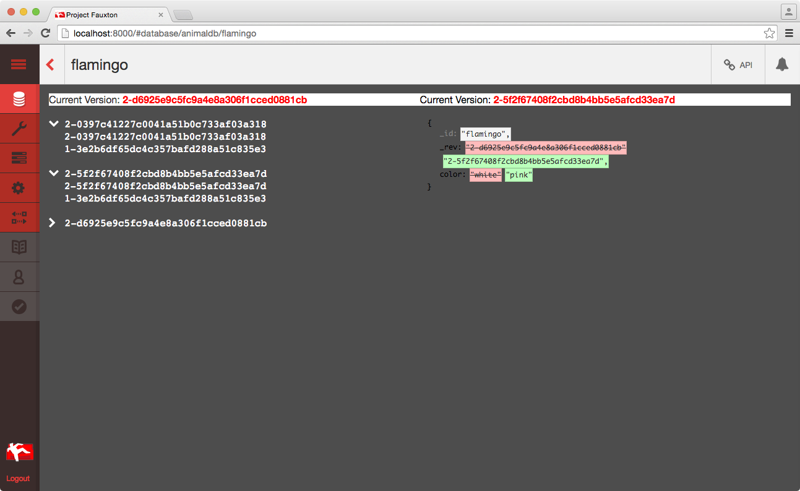
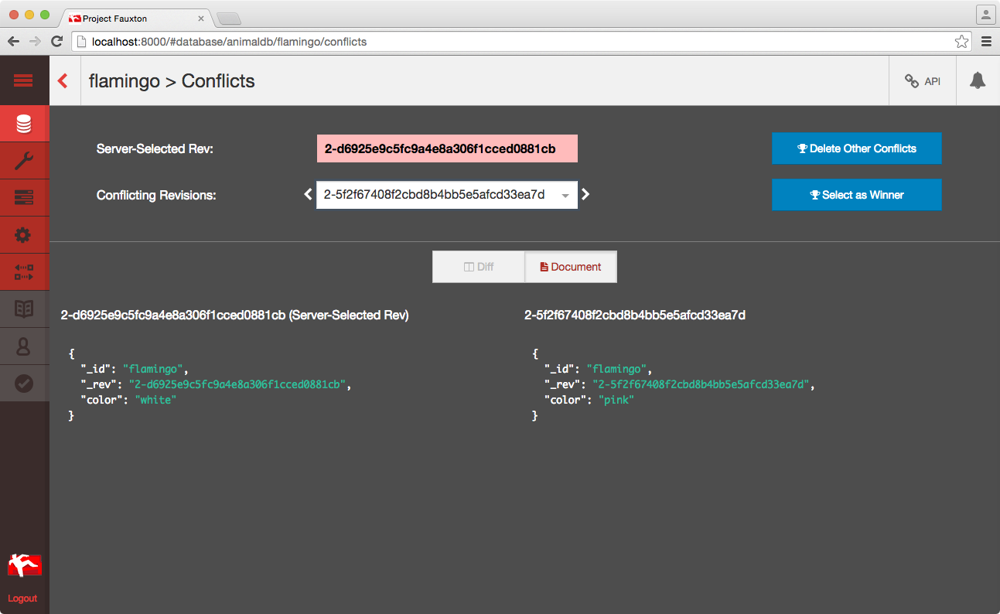
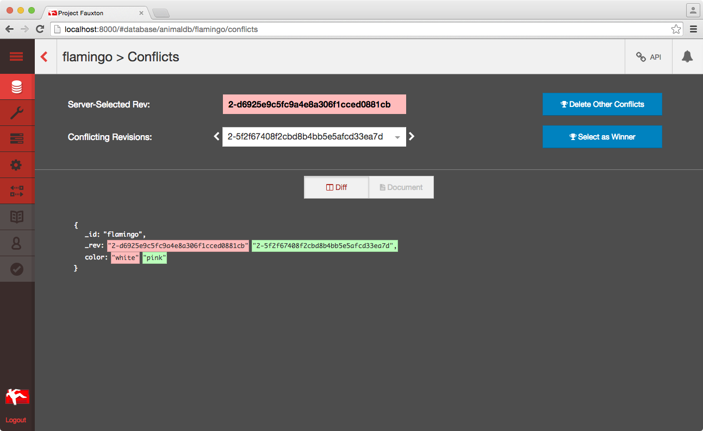

# Databases aren’t boring

It sounds super boring, sometimes scary. Let’s talk about database development, data management and database administration. Sounds boring, right? I promise: it isn’t. I mainly develop for Fauxton, the UI for CouchDB we’ll release with 2.0. We are developing, designing and concepting a UI for administration and data management.

When I tell fellow developers and designers that I develop a database, many of them look scared. Sometimes they also look bored, because people rarely imagine data management is exciting. Some of them might think of boring database courses in college. In this article we’ll discover what makes database development so interesting and exciting.

One of our main objectives is to make data management as frictionless as possible for the user. How can we lower the entry barrier for new users, but still support our power users? How can we display data in an accurate, detailed way, but still have a high density of information? How do we measure our success without traditional systems to measure engagement, like tracking? It is important to remember--we can be successful only if our users are succesful.

A recent example where we want to make our users more successful is [eventual consistency and MVCC](http://guide.couchdb.org/draft/consistency.html). Large numbers of conflicts can be problematic, they will slow down the database and take up a lot of space. Some of the Fauxton developers recently had a hackweek. As part of one project we asked ourselves: “how can we make conflict detection and resolution a first class citizen in CouchDB and make it as frictionless as possible?”.

Our goals:

- conflict detection should be as easy as possible
- make conflict resolution as easy as possible and provide necessary tooling
- help to avoid situations where a large number of conflicts become problematic
- provide better education and tutorials for conflict resolution, directly in the dashboard

We focused mainly on “conflict resolution” as our time was limited to one week. A document with conflicts has different revisions, and Couch elects one as the “winning revision”. How to choose the right revision and get rid of the other ones? Our project codenamed “the revision browser” was born. We wanted to provide a way to easily diff revisions, and inspect the revision tree. We also wanted an easy way to delete conflicting revisions and select other revisions as a winner. The first, ugly prototype had two dropdowns:

We are a distributed team, so use video calls for evaluating the iterations. We demo the current, incomplete work. Whenever possible, we test ad-hoc changes directly in the browser during the session. One addition that came up during our demos was to provide another view mode next to the “diff mode”. It shows both conflicting documents next to each other:

After the hackweek we had some work left to bring the project over the finish line. I am happy to announce that we have a minimum viable product now:

The feature was created in close collaboration with other developers and UX researchers. Here is a video showing the new features in action:

https://www.youtube.com/watch?v=3G8d7PzMVsk

<iframe width="420" height="315" src="https://www.youtube.com/embed/3G8d7PzMVsk" frameborder="0" allowfullscreen></iframe>

Data management is also interesting from the technical point of view. How can we display a lot of documents, but keep the application snappy?

The revision browser is written in React. The code itself is pretty concise as we recently added ES 2015 / ES6 support to Fauxton. Thanks to our test coverage, we can refactor large parts of Fauxton. Recently, we changed the whole infrastructure underneath without much trouble. Interested in the code? It is available at: https://github.com/apache/couchdb-fauxton/pull/670

## Conclusion

Despite its image, data management and database administration IS interesting. We face hard problems from a product point of view. They are challenging and it is fun to solve them in a team which includes developers, UX researches and designers.  We also face interesting technical problems and solve them with the best technology available.

## About the author

Robert Kowalski is a passionate software engineer and CouchDB contributor. He enjoys traveling and recently released a book about command line tools in Node.js, [The CLI Book](http://theclibook.com).
